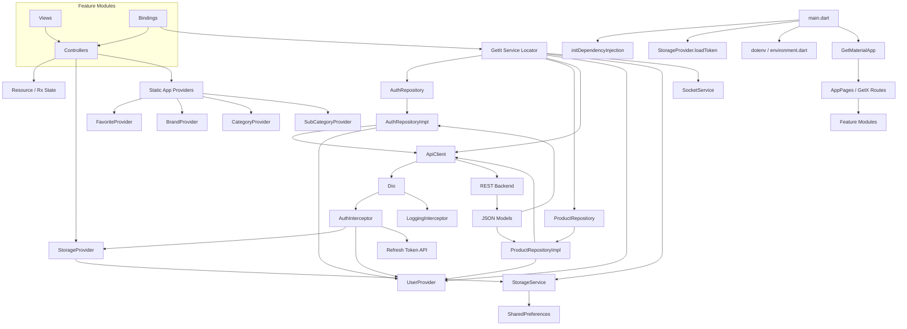
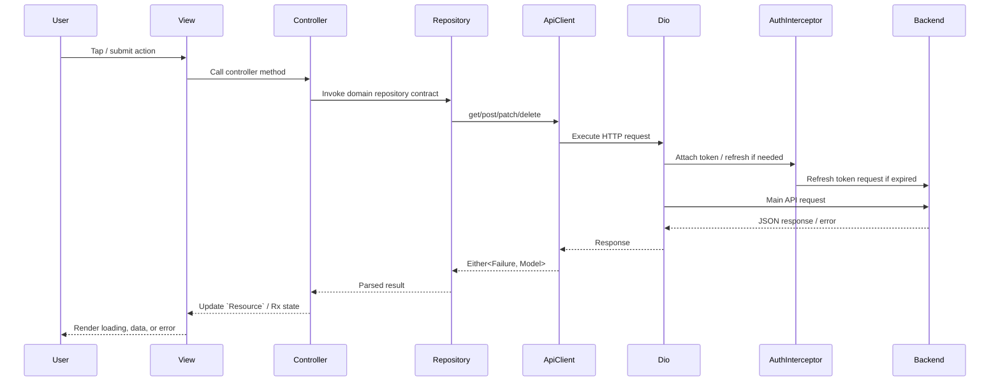

# Piano App Architecture

This diagram reflects the current Flutter app structure in this repository.

## High-Level Architecture

## Feature Request Flow

## Current Structural Notes

- App startup is centralized in `main.dart`, which initializes DI, loads cached auth tokens, loads `.env`, restores locale, and restores theme mode.
- Navigation uses `GetMaterialApp` and `AppPages`, with each feature registered as a `GetPage`.
- Each feature generally follows `binding -> controller -> repository`.
- Dependency injection is split across `GetIt` for services/repositories and `GetX` bindings for controllers.
- `ApiClient` is the shared HTTP layer and wraps Dio with common headers, timeout handling, failure mapping, and offline routing.
- `AuthInterceptor` handles bearer token injection, token refresh, and forced logout when the backend reports token/session failure.
- Persistence is abstracted through `StorageService`, currently backed by `SharedPreferences`.

## Main Layers

- `lib/app/core`: app-wide DI, theme, translations, and utilities
- `lib/app/data`: API client, interceptors, request DTOs, repository implementations, response/model parsing
- `lib/app/domain`: repository contracts, failures, resource wrappers, storage/user abstractions
- `lib/app/modules`: feature UI and presentation logic using GetX
- `lib/app/routes`: route definitions and page registration
- `lib/app/environment`: environment variables consumed by the network layer
